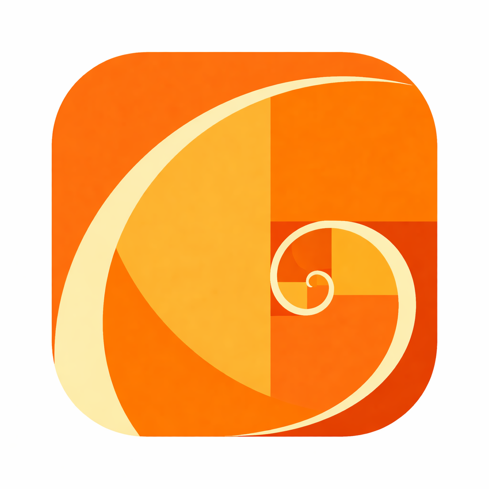

# Aude



Building biologically plausible audio scene analysis for real-world listening environments.

## Team


## Quick Links
- Project Charter: [PROJECT_CHARTER.md](PROJECT_CHARTER.md)
- Roadmap: [ROADMAP.md](ROADMAP.md)
- How to contribute: [CONTRIBUTING.md](CONTRIBUTING.md)
- Decisions log: [DECISIONS.md](DECISIONS.md)

## Workflow (non-negotiables)
1. Work starts as an Issue.
2. Issues are assigned to an owner.
3. Work happens on a branch per issue.
4. PR must link the issue (`Fixes #123`).
5. PR must pass CI + review before merge.

## Repo Structure
- `docs/meetings/` meeting notes
- `docs/experiments/` experiment tracking + results
- `docs/datasets/` dataset cards + collection notes
- `docs/hardware/` hardware specs + BOM
- `docs/REFERENCE/` reference documents (see `docs/REFERENCE/README.md`)
- `src/` implementation (create as needed)
- `scripts/` utilities (create as needed)

## How to Run

### Prerequisites
- Install [Docker](https://www.docker.com/products/docker-desktop/)
- If on Windows, install [WSL](https://docs.microsoft.com/en-us/windows/wsl/install)

### Setup
```bash
cd odas/viz
npm install
```

### Run
1. Start the scene simulation:
```bash
cd odas/
docker compose run odas python3 /odas/test_data/simulate_scene.py
```

2. Start the visualization server:
```bash
cd odas/viz
npm start
```


3. Stream to web:
```bash
cd odas/
docker compose run odas bash /odas/test_data/stream_to_web.sh
```

### License
Decide early. MIT/Apache-2.0 are common defaults.
---
